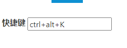
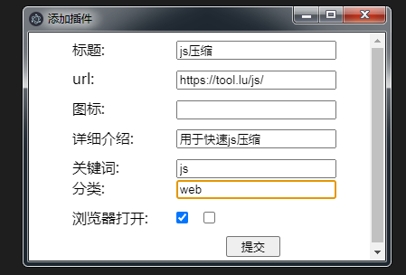
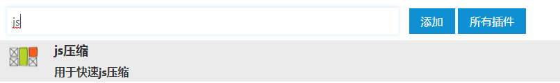

## 说明
软件快速通过关键词或者关键词的缩写打开对应的网址，因为自己常常会开一些web，进行访问。
这个软件有点借鉴utools，这个工具可以对接任何web网页，后续会加入js注入。当前版本只是简单实现web访问快速访问。

本软件只是练手electron 技术而已，后续慢慢补充各种插件和web，实现自己软件自给自足。提高自己快速编码能力和产品的驾驭能力。

## 使用
0. 默认快捷键[ctrl+alt+k],自己可以设置界面进行修改

1. 添加功能

2. 输入关键词
