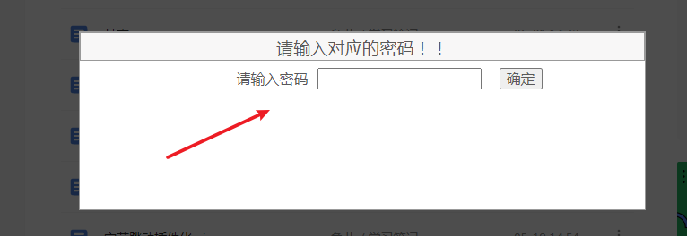
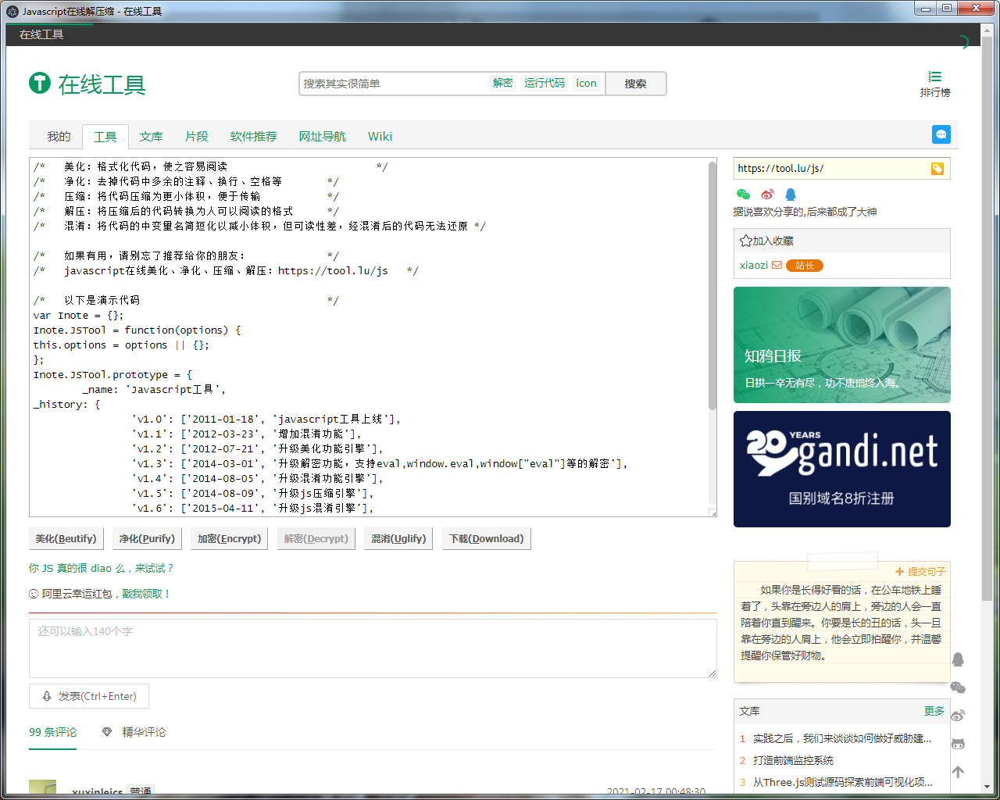

## 说明
软件快速通过关键词或者关键词的缩写打开对应的网址，因为自己常常会开一些web，进行访问。
这个软件有点借鉴utools，这个工具可以对接任何web网页，后续会加入js注入。当前版本只是简单实现web访问快速访问。

本软件只是练手electron 技术而已，后续慢慢补充各种插件和web，实现自己软件自给自足。提高自己快速编码能力和产品的驾驭能力。

## 下载
### 通过release 标签下载
通过github release 【右边点击即可】
### 通过百度网盘
链接：https://pan.baidu.com/s/1uwF7tYRFk1Ml1wP8kgs1Pw 
提取码：1234 
--来自百度网盘超级会员V5的分享

## 更新 1.0.0.3
1. 增加内存map读写接口
2. 增加网络访问接口，解决跨域问题
3. 增加F12打开开发者模式

### 内存接口
    //设置map
     window.app_mem_map.set(mem_key, gap)

     //获取Map的值
     window.app_mem_map.get(mem_key)

    //删除
     window.app_mem_map.delete    

     //是否包含  
     window.app_mem_map.has

### 网络接口
    //get 请求
    request_get

    //post 表单请求
    request_post_form

### 增加网页定时器JS插件

## 更新
支持JS注入，方便把别的web变成自己的应用，这个也是这个软件核心思想。

### 语雀网页版本增加打开密码限制【自己测试例子】

输入密码helloworl123，目前是写死的，自己也可以直接在配置目录修改插件的代码。

目前云插件只是2个能用插件，这个只是自己开发着玩。

语雀插件代码
    
    (function(){
	
    if (typeof jQuery == 'undefined') { 
        // jQuery 未加载 
        console.log("juqery 没有加载")
        load_js_file("https://cdn.bootcdn.net/ajax/libs/jquery/3.6.0/jquery.min.js", loadOk)
    } else { 
        // jQuery 已加载 
        console.log("juqery 加载了")
        loadOk()
    }

	
	
	function loadOk(){

        var html = $('

请输入对应的密码！！

<label style="margin:10px">请输入密码</label><input id="input_my_js_password" style="margin-right:10px"><button style="margin-left:10px" id="js_plugin_check_ps_btn">确定</button>
<label id="js_plugin_error_text"></label>

')
        $("body").append(html)
        
        $('#js_plugin_check_ps_btn').on('click', function(){
            var passworld = $('#input_my_js_password').val();
            if(passworld != "helloworld123"){
                $('#js_plugin_error_text').text("密码错误,请重新输入!")
            }else{
              document.documentElement.style.overflowY = 'scroll'
              closeWindow();
            }
        })

        document.documentElement.style.overflowY = 'hidden'
        showWindow();	
	}

    function showWindow() {
        $('#showdiv').show();  //显示弹窗
        $('#cover').css('display','block'); //显示遮罩层
      }

    // 关闭弹窗
    function closeWindow() {
        $('#showdiv').hide();  //隐藏弹窗
        $('#cover').css('display','none');   //显示遮罩层
    }    

    })()

我为了方便JS动态加载，我提供JS还在API，方便自己导入脚本
load_js_file函数
load_js_file(url, call_back)
动态加载网络js，加载成功调用回调，比喻上面例子，为了方便加载Jquery，调用该函数。

## 使用
0. 默认快捷键[ctrl+alt+k],自己可以设置界面进行修改

1. 添加功能

2. 输入关键词

3. 回车打开

## 下载安装包
点击release进行下载
